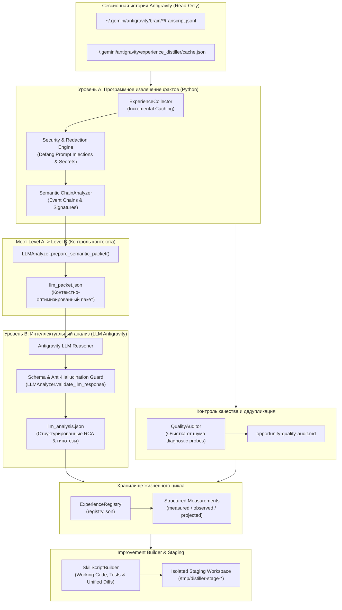

# Архитектура Experience Distiller v2.1

## 1. Концепция и цели модернизации v2.1

Experience Distiller v2.1 преобразует систему из набора статических регулярных выражений и эвристик в **двухуровневую систему непрерывного интеллектуального самоулучшения**:
1. **Уровень A (Программное извлечение фактов):** детерминированный сбор сырых событий, кодов выхода, диагностических сообщений, временных меток и цепочек сбоев без интерпретации.
2. **Уровень B (Интеллектуальная интерпретация LLM):** семантическое осмысление причин сбоев, выявление неэффективных действий агента, синтез минимальных рабочих улучшений и проверка гипотез.

---

## 2. Архитектурная диаграмма двухуровневой системы



---

## 3. Детальное описание компонентов v2.1

### 3.1. Уровень A — Программный сбор фактов
- **`src/collector.py`:** инкрементально сканирует `~/.gemini/antigravity/brain/` с сохранением mtime и размера файлов в `cache.json`.
- **`src/chain_analyzer.py`:** объединяет шаги сессии в направленные цепочки `Action → Error → Fix → Verification`. Подсчитывает `trial_and_error_count` и `wasted_steps`.
- **`src/security.py`:**
  - Маскирует секреты (пароли, GitHub PAT, JWT, bearer-токены);
  - Обезвреживает потенциальные Prompt Injection (`ignore previous instructions`, `<system>`, `you are now unrestricted`) маркерами `[DEFANGED_INJECTION_*]`.

### 3.2. Мост Level A $\rightarrow$ Level B и экономия контекста
- **`src/llm_analyzer.py` (`prepare_semantic_packet`):**
  - Группирует 400+ сырых цепочек в 15 репрезентативных кластеров по каноническим сигнатурам ошибок;
  - Ограничивает примеры до 3 репрезентативных вызовов на кластер;
  - Сохраняет список доверенных идентификаторов сессий (`valid_session_ids`);
  - Общий размер пакета удерживается в пределах 25 КБ, что предотвращает перегрузку контекстного окна модели.

### 3.3. Уровень B — Интеллектуальный анализ LLM
- Агентная интерпретация причин (`why_agent_erred`), лишних действий (`redundant_actions`), ключевых исправлений (`key_fix`) и стратегий предотвращения (`prevention_strategy`).
- **Anti-Hallucination Guard:** строгая проверка, что каждое доказательство в ответе модели ссылается **только** на реально присутствующий в пакете `session_id`.

### 3.4. Аудитор качества и дедупликатор (`src/quality_auditor.py`)
- Устраняет проблему 80 записей v2, где диагностические вызовы (`which`, `grep -q`, `cat nonexistent`) ошибочно принимались за сбои.
- Классифицирует возможности по 6 вердиктам:
  - `confirmed` — подтверждённая системная проблема;
  - `already_solved` — проблема уже решена существующим скриптом или скиллом;
  - `duplicate` — симптом, дублирующий корневую возможность;
  - `weak_evidence` — штатная диагностическая команда или разовый шум;
  - `needs_review` — требует дополнительных данных;
  - `obsolete` — устаревшее предложение.

### 3.5. Структурированные измерения эффективности
В `registry.json` фиксируются замеры с разделением категорий:
- `measured` — воспроизводимые тесты до и после;
- `observed` — поведение в последующих сессиях;
- `projected` — расчётный теоретический эффект.

```json
{
  "metric": "execution_time",
  "type": "measured",
  "before": 45.0,
  "after": 0.05,
  "unit": "seconds",
  "improvement_pct": 99.89,
  "conditions": "Manual line-by-line replacement vs automated script",
  "timestamp": 1775621214.0
}
```

### 3.6. Improvement Builder с изолированной зоной
- `src/builder.py` генерирует не пустые заготовки, а **полноценные рабочие скрипты, unit-тесты и unified diff патчи**.
- Изменения размещаются в `/tmp/distiller-stage-<id>/`, гарантируя неприкосновенность рабочего дерева пользователя без явного подтверждения.
