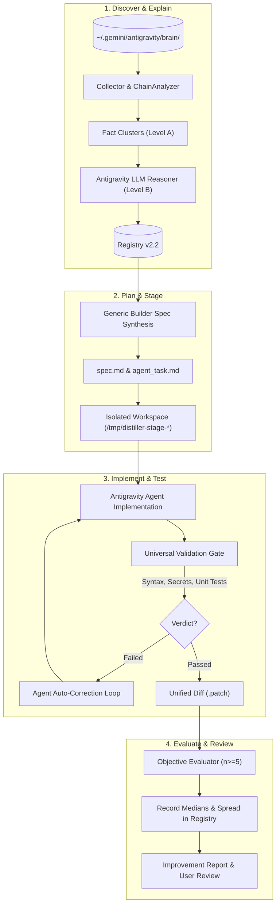

# Архитектурное руководство: Experience Distiller v2.2 (Autonomous Improvement Loop)

## 1. Концепция и цели v2.2

Experience Distiller v2.2 трансформирует систему из аналитического агрегатора отчётов в **автономный замкнутый контур самоулучшения Antigravity (Autonomous Improvement Loop)**.

Главный фокус v2.2:
1. **Устранение жестко зашитых шаблонов решений** из Python-кода `builder.py`. Builder теперь выступает оркестратором спецификаций, стейджинга и проверочных шлюзов.
2. **Двухуровневый автономный LLM-анализ** с пакетной обработкой (`batching`), контролем контекстного бюджета и возобновлением (`resumption`).
3. **Строгая изоляция разработки** (`staging` в `/tmp/distiller-stage-*` или git worktree) без несанкционированного изменения рабочего дерева пользователя.
4. **Объективная воспроизводимая оценка (Anti-Fake Benchmarking)**: исключение приписок и фиктивных ускорений, строгое разделение машинных замеров (`measured`, n $\ge$ 5, медиана + разброс) и сессионных задержек (`observed_session`).
5. **Независимый Validation Gate**: синтаксический контроль, запуск hermetic-тестов, сканирование утечек секретов и генерация unified diff (`.patch`).

---

## 2. Диаграмма жизненного цикла: 7 фаз



---

## 3. Компоненты системы v2.2

| Модуль | Назначение в v2.2 | Изменения относительно v2.1 |
|---|---|---|
| `src/builder.py` | Универсальная оркестрация улучшений, генерация `ImprovementSpec`, развёртывание изоляции, запуск `Validation Gate` | Полностью удалены жестко зашитые строковые шаблоны решений; добавлен независимый проверочный шлюз |
| `src/evaluator.py` | Научно воспроизводимое тестирование эффективности (`ObjectiveEvaluator`) | **Новый модуль**: повторные замеры (n $\ge$ 5), вычисление медианы, min/max, std_dev, защита от ложных ускорений |
| `src/llm_analyzer.py` | Двухуровневый мост анализа сессий | Добавлена пакетная нарезка (`prepare_chunked_packets`), трекер состояния (`llm_state.json`) и возобновление после сбоев |
| `src/registry.py` | Персистентный реестр возможностей v2.2 | Поддержка стадий жизненного цикла (`staged`, `tested`, `validated`), хранение протоколов бенчмарков |
| `src/cli.py` | CLI-интерфейс | Новые команды: `improve`, `improvement-status`, `improvement-report`, `benchmark` |
| `src/quality_auditor.py` | Фильтр диагностического шума | Классификация находок по 6 категориям качества с сохранением обоснований |
| `src/security.py` | Защита от утечек и инъекций | Сканирование staged-кода на токены/пароли перед выпуском патча |

---

## 4. Спецификация контракта Validation Gate

Каждое улучшение обязано пройти проверку четырёх независимых инвариантов:

```
ValidationGate:
  1. SyntaxCheck:
     - Python: python3 -m py_compile <file>
     - Node.js: node -c <file>
     - Shell: bash -n <file>
     - JSON: json.loads(<file>)
  2. SecurityCheck:
     - scan_for_secrets(<content>) == []
     - defang_prompt_injection(<content>)
  3. FunctionalTestExecution:
     - run_tests.sh или node --test / unittest
     - Обязательное условие: returncode == 0
     - Hermetic isolation: временные каталоги fs.mkdtempSync()
  4. UnifiedDiffIntegrity:
     - difflib.unified_diff против исходного файла или /dev/null
     - Генерация воспроизводимого .patch файла
```

Если тесты не обнаружены или не могут быть запущены в текущем окружении, шлюз возвращает статус `not_tested`, который **ни при каких условиях** не приравнивается к `passed`.
