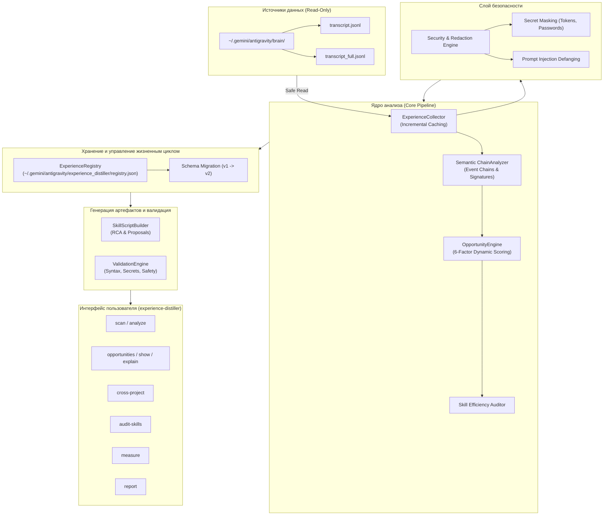

# Архитектура Experience Distiller v2

## 1. Введение и концепция

`experience-distiller` v2 — автономная система анализа сессионного опыта Antigravity, предназначенная для выявления возможностей оптимизации, устранения повторяющихся ошибок и создания целенаправленных инструментов (CLI-скриптов и скиллов) на основе реальных фактов разработки.

В отличие от v1, полагавшегося на статические регулярные выражения и фиксированные шаблоны, v2 использует **гибридный семантический подход**:
1. **Детерминированный сбор данных:** извлечение хронологии команд, кодов выхода, диагностических сообщений и затронутых файлов.
2. **Семантическая реконструкция цепочек событий:** выявление циклов проб и ошибок вида `Task → Action → Result → Error → Fix → Verification`.
3. **Многофакторный динамический скоринг:** расчёт приоритета (0–100) и уверенности (0–100) по 6 взвешенным факторам.
4. **Защита от Prompt Injection:** фильтрация и обезвреживание враждебных или манипулятивных инструкций из логов.
5. **Аудит эффективности скиллов и кросс-проектная синергия:** сопоставление сбоев с существующими глобальными скиллами.

---

## 2. Архитектурная схема компонентов



---

## 3. Детальное описание модулей

### 3.1. `src/security.py` — Слой безопасности и фильтрации
- **Secret Redaction:** регулярные выражения для маскировки приватных токенов (`ghp_*`, `glpat-*`, OAuth, JWT, `QaPass2026!`, Bearer, пароли CLI).
- **Prompt Injection Defense:** перехват манипулятивных конструкций внутри текстов (`ignore previous instructions`, `system prompt:`, `<system>`, `you are now unrestricted`) с их заменой на безопасные деактивированные маркеры `[DEFANGED_INJECTION_*]`.
- **Гарантия неизменяемости:** сессионные директории открываются исключительно с флагом чтения (`"r"`).

### 3.2. `src/chain_analyzer.py` — Семантический реконструктор цепочек
- Анализирует поток шагов сессии.
- Идентифицирует сбои (ненулевые exit code, SyntaxError, exceptions, test failures).
- Отслеживает промежуточные шаги исследования (`view_file`, `search_web`, неудачные повторные запуски) и шаги исправления (`replace_file_content`, `write_to_file`).
- Фиксирует успешную верификацию (`exit_code == 0` на повторном запуске).
- Вычисляет метрики:
  - `trial_and_error_count` — число попыток до успеха;
  - `wasted_steps` — потраченные вхолостую шаги;
  - `error_signature` — каноническая сигнатура ошибки;
  - `root_cause_guess` — гипотеза первопричины.

### 3.3. `src/collector.py` — Инкрементальный сборщик сессий
- Сканирует `~/.gemini/antigravity/brain/`.
- Поддерживает инкрементальный кэш `~/.gemini/antigravity/experience_distiller/cache.json`, сверяя `mtime` и размер файла `transcript.jsonl`.
- Извлекает метаданные: проект, пользовательский запрос, выполненные команды, действия с файлами, вызовы MCP-инструментов.

### 3.4. `src/engine.py` — Генератор возможностей и 6-факторный скоринг
Вычисляет приоритет (Priority, 0–100) по 6 взвешенным факторам:
1. **Time/Waste ($25\%$):** объём потерянных шагов и времени на отладку.
2. **Frequency ($20\%$):** повторяемость в сессиях и запусках.
3. **Criticality ($20\%$):** критичность проблемы (Blocker, Critical, Medium, Low).
4. **Cross-Project ($15\%$):** охват экосистемы (1, 2, 3+ проектов).
5. **Evidence Depth ($10\%$):** доказательная база (количество логов и примеров).
6. **Ease of Fix ($10\%$):** простота реализации решения (Quick, Medium, Complex).

Уверенность (Confidence, 0–100) вычисляется независимо на базе количества подтверждающих сессий.

Сопоставляет обнаруженные сбои с каталогом установленных скиллов `~/.gemini/config/skills/`, выявляя неэффективность или пробелы в существующих инструкциях.

### 3.5. `src/registry.py` — Реестр и миграция схемы
- Хранилище: `~/.gemini/antigravity/experience_distiller/registry.json`.
- Автоматическая миграция v1 $\rightarrow$ v2 при загрузке:
  - Добавление полей `root_cause`, `proposed_solution`, `alternatives`, `expected_benefit`, `actual_benefit`, `related_skills`, `validation_results`, `error_chains`, `scoring_breakdown`.
  - Сохранение пользовательских статусов (`investigating`, `approved`, `implemented`, `validated`).
- Метод `record_actual_benefit`: фиксация фактического эффекта после внедрения инструмента с переводом в статус `validated`.

### 3.6. `src/builder.py` & `src/validator.py` — Синтез и валидация
- `SkillScriptBuilder`: генерация скриптов Node.js/Bash и скиллов `SKILL.md` с явным указанием Root Cause, Alternatives и чеклиста верификации.
- `ValidationEngine`: статическая верификация синтаксиса (Node.js `--check`, Python `py_compile`, Bash `-n`), сканирование на утечки секретов и проверка на опасные деструктивные команды.

### 3.7. `src/cli.py` — Единый CLI-диспетчер
- Команды: `scan`, `analyze`, `opportunities`, `show`, `explain`, `cross-project`, `audit-skills`, `measure`, `propose`, `validate`, `status`, `report`.

---

## 4. Схема структуры данных (JSON Schema v2)

```json
{
  "id": "opp-rout-virtualbox_guestcontrol_vm_sync",
  "category": "routine",
  "title": "Устойчивая автоматизация управления Windows VM (Winda)",
  "description": "В 4 сессиях зафиксирована повторяющаяся цепочка сбоев (5 попыток, 8 потраченных шагов).",
  "target_scope": "global",
  "affected_projects": ["infra", "boosty-chat-overlay"],
  "evidence_sessions": ["5f965a7f", "bd304929", "8ecbcb27"],
  "evidence_details": ["Error: VBoxManage guestcontrol -> Fix: manual correction"],
  "priority": 94,
  "confidence": 98,
  "benefit_assessment": "Экономия 4 шагов на сессию и устранение потерь контекста.",
  "recommended_solution": "Использовать специализированный CLI runner (scripts/qa/winda-sync.js)...",
  "estimated_effort": "quick",
  "action_type": "new_script",
  "target_path": "scripts/qa/winda-sync.js",
  "status": "new",
  "tags": ["semantic-chain", "virtualbox_guestcontrol_vm_sync"],
  "root_cause": "VM is powered off, guest additions not ready, or credentials/flags mismatch",
  "proposed_solution": "Использовать специализированный CLI runner (scripts/qa/winda-sync.js)...",
  "alternatives": [
    "Прямой скрипт VBoxManage с тайм-аутами",
    "SSH / WinRM подключение к ВМ",
    "Общая папка VirtualBox Shared Folders"
  ],
  "expected_benefit": "Предотвращение 5 холостых повторов и сокращение времени отладки.",
  "actual_benefit": null,
  "related_skills": ["windows-qa-winda", "hv-vm"],
  "error_chains": [...],
  "scoring_breakdown": {
    "time_waste": 89.0,
    "frequency": 100.0,
    "criticality": 85.0,
    "cross_project": 80.0,
    "evidence_depth": 100.0,
    "ease_of_fix": 95.0
  },
  "history": [
    {"status": "new", "note": "Initial discovery"}
  ]
}
```
